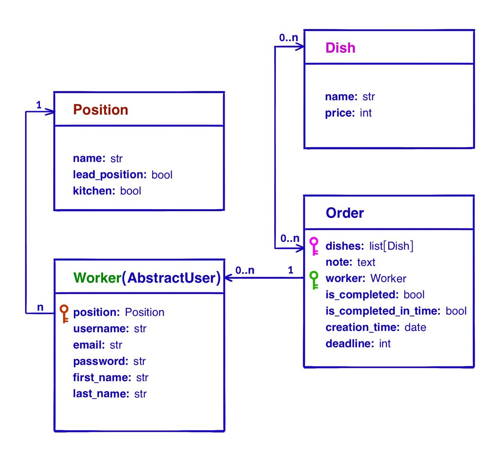

# restaurant_kitchen_service
The restaurant_kitchen_service project is designed to demonstrate the working relationships between kitchen staff in a restaurant setting.

## Project Overview
This project models a restaurant kitchen's operations with four main components: Worker, Position, Dish, and Order.

</img>

<a href="https://www.loom.com/share/306988a1914742fb97bc7f355b7ac164?sid=31640267-2cd9-46f2-9c1c-d9a7b9a6f89e">
loom demonstration of interface</a>

## Features
### User and Position Management
* Workers and Positions can be added and managed within the application.
* Each worker is assigned a position that dictates their permissions within the app. Positions can be administrative and/or kitchen-related.
* Only users with administrative roles can create, update, or delete workers, positions, and dishes.

## Order Management
* Kitchen staff can claim and complete orders assigned to themselves or their colleagues.
* When creating an order, you can select multiple dishes and assign the order to a kitchen worker.
* Orders have deadlines, with a default of 60 minutes. This can be adjusted during order creation or updated later.
* Users can view their personal information and all orders associated with them on their profile page.
* Incomplete orders can be updated or deleted, and users can claim orders from colleagues to assist in their completion.

## Access and Authentication
* Access to all pages, except the main page, requires user authentication.

## A search functionality is provided for:
* Workers (by username)
* Positions and dishes (by name)
* Orders (by worker or creation date)

## Additional Features
Pagination is implemented on all pages to improve navigation and usability.
Comprehensive tests have been written for both custom and core project features to ensure reliability.

## Check it out!

[Restaurant Kitchen project deployed to Render](https://restaurant-kitchen-service-a082.onrender.com/)

Use the following credentials to test the application:

Login: admin1
Password: qwerty12345!

## Conclusion
Enjoy exploring the restaurant_kitchen_service application. Add orders, create new positions, and manage your kitchen efficiently!

Feel free to replace the placeholder https://github.com/yourusername/restaurant_kitchen_service.git with the actual URL of your GitHub repository.
